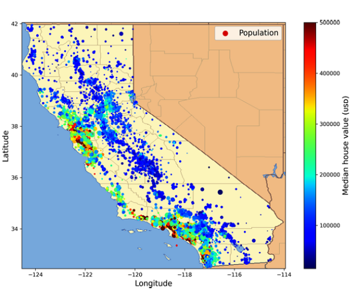

## Previsão do preço de casas no estado da Califórnia - EUA

- O objetivo deste projeto, é desenvolver habiliades na construção de um modelo de _Machine Learning_ capaz de realizar predições do preço de casas no estado da Califórnia, nos EUA. O dataset utilizado está disponível para download no [Kaggle](https://www.kaggle.com/). 
- As variáveis disponíveis nesse dataset para a construção do modelo, serão mostradas posteriormente, mas de antemão, aqui vai um breve resumo das mesmas:
    - longitude: longitude
    - latitude: latitude 
    - housing_median_age: idade média da casa
    - total_rooms: número total de cômodos
    - total_bedrooms: número total de quartos
    - population: população
    - households: famílias
    - median_income: renda média
    - ocean_proximity: proximidade do oceano
    - median_house_value: valor médio da casa
- A variável (_target_) que iremos prever, é a _median_house_value_, ou valor médio da casa.
- Será feita uma análise completa, desde a importação das bibliotecas e dos dados, passando pela análise exploratória dos mesmo, trabalhando com todo o pré-processamento dos dados, tratamento de _features_ categóricas, _impute_ de valores faltantes e escalonamento de _features_ numéricas.

